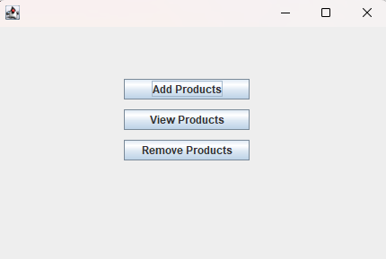
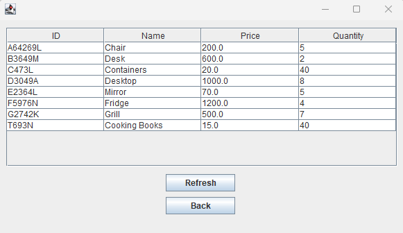
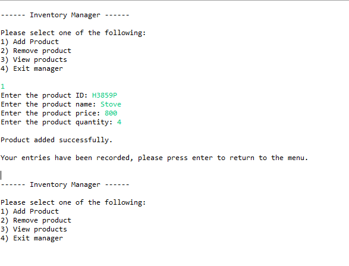

# Inventory Management System (Java + PostgreSQL)


## Overview

This project is a desktop-based Inventory Management System built using Java Swing and PostgreSQL.  

It allows users to add, view, and remove products through a graphical user interface (GUI) with persistent database storage.


The application was initially developed as a command-line interface (CLI) program and later extended into a full GUI-based system with database integration.

---

## How to Run

1. Open the project in Eclipse (or another Java IDE)
2. Ensure PostgreSQL is installed and running
3. Create the database and run `sql/schema.sql`
4. Update database credentials in `DBConnection.java`
5. Run the application:

### GUI Version
Run `MainMenuGUI.java`

### CLI Version (Optional)
Run `Main.java`

---


## Features

- Add new products with ID, name, price, and quantity

- View all products in a structured table (JTable)

- Remove products by ID

- Persistent data storage using PostgreSQL

- Multi-screen GUI navigation (Main Menu, Add, View, Remove)

- Original command-line interface (CLI) program (Main Menu, Add, View, Remove)

---

## Tech Stack

- **Java** (Core + OOP)

- **Swing** (GUI)

- **PostgreSQL** (Database)

- **JDBC** (Database connectivity)

- **Eclipse IDE**

---

## Screenshots

### Main Menu


### Add Product


### View Products


### Remove Product


### CLI Demo


---

## Database Setup

1. Install PostgreSQL

2. Create a database named: inventorydb

3. Run the SQL script located in: sql/schema.sql

---

## Configuration

Update your database credentials in: DBConnection.java

Example:

```java

private static final String URL = "jdbc:postgresql://localhost:5432/inventorydb";

private static final String USER = "your_username";

private static final String PASSWORD = "your_password";

---

## Project Structure

InventoryApp/
├── src/
│ └── inventoryapp/
│ ├── Product.java
│ ├── ProductDAO.java
│ ├── DBConnection.java
│ ├── MainMenuGUI.java
│ ├── AddProductGUI.java
│ ├── ViewProductsGUI.java
│ └── RemoveProductGUI.java
├── sql/
│ └── schema.sql
├── screenshots/
├── README.md
├── .gitignore
